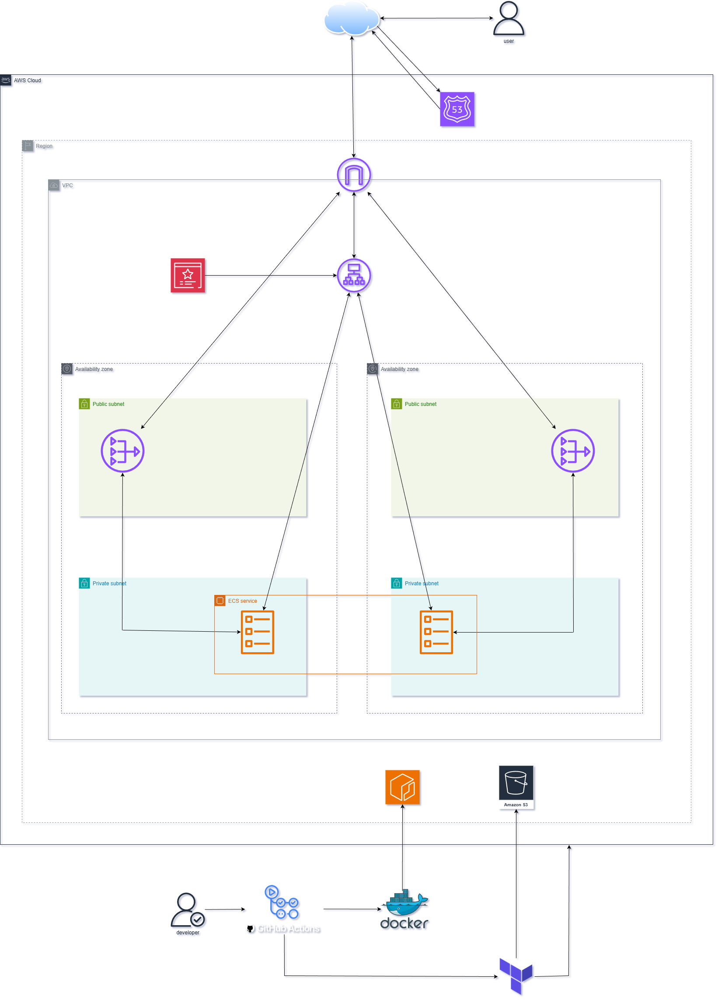
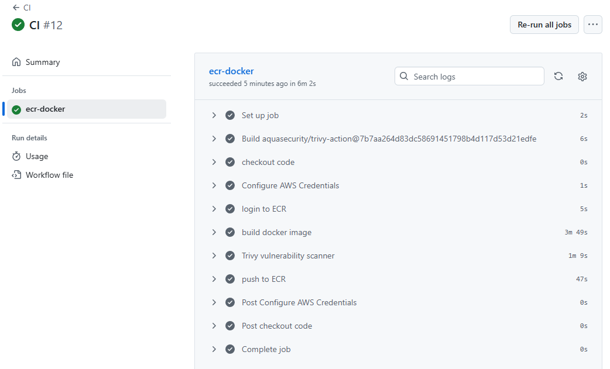

# My Production level ECS project

### In this project I deploy a containerised app using Docker to AWS with Infrastructure as Code using Terraform and automate developer changes using GitHub Actions as my CI/CD.

## Project Overview

I containerised an open-source application using Docker to ensure consistent behaviour across all environments. I used multi stage builds to reduce image size and ran the container as a non-root user for security.

I initially deployed the infrastructure using AWS ClickOps, then tore everything down and rebuilt it using Terraform as Infrastructure as Code. I configured the AWS provider and structured the setup using reusable modules.

I built a VPC across two availability zones with public and private subnets, route tables, an internet gateway, and NAT gateways. I created security groups so the ALB accepts HTTP, HTTPS, and container port traffic from the internet, while ECS tasks only accept traffic from the load balancer, preventing direct internet access.

I set up an Application Load Balancer with listeners, target groups across private subnets, and enforced HTTP to HTTPS redirection. I used Route 53 and ACM to point my domain to the ALB and enable SSL/TLS.

I referenced an existing ECR repository through a Terraform module to output the image URI, then deployed the application using ECS to run the container.

Finally, I implemented CI/CD with GitHub Actions so code changes automatically build and push Docker images to ECR, and pipelines can apply or destroy the Terraform infrastructure as needed.

## Local App Setup

```bash
yarn install
yarn build
yarn global add serve
serve -s build

#yarn start
http://localhost:3000/workspaces/default/dashboard

```

## Architecture Diagram



## File structure:

```
.
.github/
└── workflows
    ├── cd.yaml
    ├── ci.yaml
    └── destroy.yaml
infra
├── main.tf
├── modules
│   ├── acm
│   │   ├── main.tf
│   │   ├── output.tf
│   │   └── variables.tf
│   ├── alb
│   │   ├── main.tf
│   │   ├── output.tf
│   │   └── variables.tf
│   ├── ecr
│   │   ├── main.tf
│   │   └── output.tf
│   ├── ecs
│   │   ├── main.tf
│   │   └── variables.tf
│   ├── route53
│   │   ├── main.tf
│   │   └── variables.tf
│   ├── sg
│   │   ├── main.tf
│   │   ├── output.tf
│   │   └── variables.tf
│   └── vpc
│       ├── main.tf
│       ├── output.tf
│       └── variables.tf
├── provider.tf
├── terraform.tfvars
└── variables.tf
```

## Security Group for ALB

The security group for the load balancer allows incomming HTTP, HTTPS, and the docker image container port traffic from the IPv4 internet (0.0.0.0/0)


The security group for the ECS tasks allows incoming HTTP, HTTPS, and the docker image container port traffic from the security group of the ALB


## The resource map for the VPC


As we can see I have configured it so that there is one public route table which has both public subnets associated to it, it routes them to the internet gateway. Then I have a private route tables for each private subnet, it routes each subnet to its own NAT gateway. The reason why I have 2 NAT gateways in my infrastructure is because of high availability. There is a NAT gateway in each public subnet so that if one availability zone goes down, the other availability zone is still up and running because it has its own NAT gateway

## The ECR repo


I did this part manually and locally and i reference the ECR repo in my terraform ECR module with a data block. I also ensure that developers changes are automated and a new docker image is built and pushed to ECR through my CI pipeline

## The ALB resource map


Here we can see that the HTTP listener redirects HTTP requests to the HTTPS listener, and the HTTPS listener forwards the HTTPS requests to the target group which automatically registers targets via the ECS service. Both targets are healthy

## Route 53 and ACM certificate


Here we can see that I have an Alias A record that points my domain name to the ALB dNS name, so that whenever someone visits my domain they are pointed to the ALB DNS name. I have also configured a CNAME record for the SSL/TLS certificate.

## ECS cluster service + tasks


Here I have configred a task definition which is trigged through my ECS service, this creates the amount of tasks specified in the task definition. Both tasks are running and healthy

## CI pipeline, this builds the docker image with updated changes and pushes it to ECR



My CI pipeline is a manual trigger. Firstly it checks out the code and configures AWS credentials. I have used secrets to store my AWS access keys because that is sensitive data. Then it logs into ECR and builds a new docker image and pushes it to ECR. So whenever developers make changes to the code and push to GitHub, they can manually run the pipeline to build an updated docker image. Then the CD pipeline can be run to deploy the updated docker image

## CD pipeline, this runs terraform apply and starts building the infrastructure. I have also included a confirmation check


My CD pipeline is manually triggered and includes a safety check that requires the user to explicitly enter `plan` or `apply`. If any other input is provided, the pipeline fails early.

The pipeline checks out the code, configures AWS credentials using secrets to protect sensitive access keys, and sets up Terraform.

If `plan` is selected, the pipeline initialises Terraform, runs Checkov with `soft_fail`: true so security issues are reported without failing the pipeline, and then runs `terraform plan` to preview infrastructure changes.

If `apply` is selected, the same steps run, but Checkov is configured with `soft_fail`: false. In this case, any detected issues cause the pipeline to fail and prevent `terraform apply --auto-approve` from executing.

In the .yaml file I specified some `skip_steps` for specific reasons that can be viewed in the file itself.

## Destroy infra pipeline, this runs terraform destroy and removes the infrastructure. I have also included a confirmation check


My destroy infra pipeline is a manual trigger. It has a safety check to ensure that the developer types 'yes' to run the pipeline. Firstly it checks out the code and configures AWS credentials. I have used secrets to store my AWS access keys because that is sensitive data. After that it sets up terraform and runs the command:

```
terraform init
```

This initialises the terraform, after that we run the command:

```
terraform destroy --auto-approve
```

This tears down the infrastructure

## This is the deployed app


