# My Production level ECS project

### In this project I deploy a containerised app using Docker to AWS with Infrastructure as Code using Terraform and automate developer changes using GitHub Actions as my CI/CD.

## Project Overview

I have containerised an open source application using docker to ensure that the app runs the same on every environment. I used multistage builds in order to keep the docker image to a small size, I have also ensured that the Docker image runs as a rootless user for security purposes.

I created an ECR repo to store my image, and I made the infrastructure using ClickOps (deploying via the AWS console). This was just the first part, I tore it all down and began the infrastructure using Terraform as my Infrastructure as Code tool.

I then started the infrastructure for the project. I started with the provider block to ensure that I am deploying on AWS. I made modules for each resource I needed. Firstly I started with VPC so I made my public and private subnets, route tables, NAT gateways, internet gateways, and configured 2 availability zones within the region.

I created security groups for a load balancer which accepts HTTP, HTTPS, and my container port traffic from the internet. I then made a security group for the ECS tasks that accept the same traffic but only from the load balancer. This ensures that the ECS tasks do not get requests from the internet, the requests must come from the load balancer.

Then i set up the Application Load balancer, the ALB listeners, and a target group so that I can distribute traffic to both private subnets. I also made sure that HTTP requests are redirected to HTTPS.

I also made an ECR module to reference my existing ECR repo, this is so I can output my image URI.

I created a Route 53 and ACM module to point my domain to the ALB DNS name and to also give it a SSL/TLS certificate to enable HTTPS.

Then i created the ECS module so that I can run my image as a container on the AWS cloud.

Finally I automated code changes through CI/CD so that when a developer makes changes, they can build the docker image and push it to ECR from GitHub actions. This means that the terraform infrastructure can pull updated images. They can also apply the infrastructure and destroy it too because I have made pipelines for those functions too.

## Architecture Diagram


## File structure:

```
.
.github/
└── workflows
    ├── cd.yaml
    ├── ci.yaml
    └── destroy.yaml
infra
├── main.tf
├── modules
│   ├── acm
│   │   ├── main.tf
│   │   ├── output.tf
│   │   └── variables.tf
│   ├── alb
│   │   ├── main.tf
│   │   ├── output.tf
│   │   └── variables.tf
│   ├── ecr
│   │   ├── main.tf
│   │   └── output.tf
│   ├── ecs
│   │   ├── main.tf
│   │   └── variables.tf
│   ├── route53
│   │   ├── main.tf
│   │   └── variables.tf
│   ├── sg
│   │   ├── main.tf
│   │   ├── output.tf
│   │   └── variables.tf
│   └── vpc
│       ├── main.tf
│       ├── output.tf
│       └── variables.tf
├── provider.tf
├── terraform.tfvars
└── variables.tf
```

## Security Group for ALB

The security group for the load balancer allows incomming HTTP, HTTPS, and the docker image container port traffic from the IPv4 internet (0.0.0.0/0)

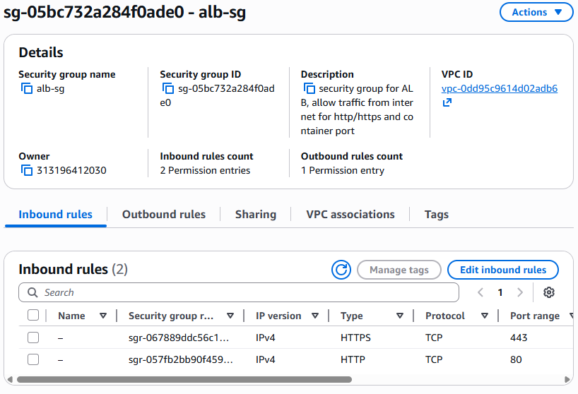

The security group for the ECS tasks allows incoming HTTP, HTTPS, and the docker image container port traffic from the security group of the ALB

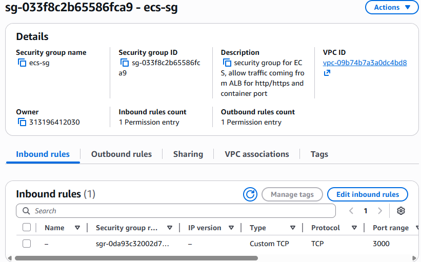

## The resource map for the VPC

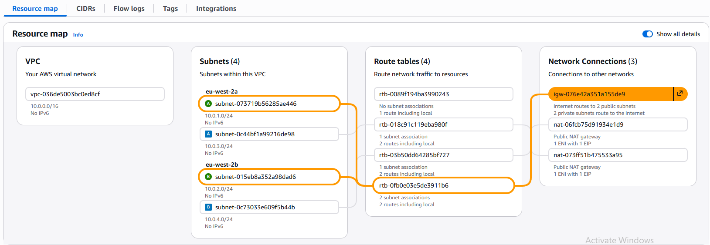
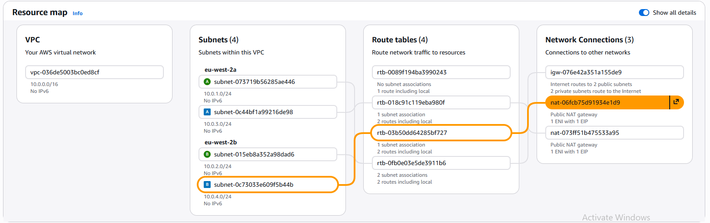
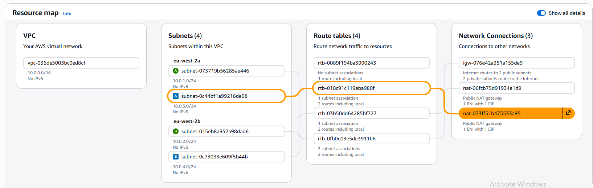

As we can see I have configured it so that there is one public route table which has both public subnets associated to it, it routes them to the internet gateway. Then I have a private route tables for each private subnet, it routes each subnet to its own NAT gateway. The reason why I have 2 NAT gateways in my infrastructure is because of high availability. There is a NAT gateway in each public subnet so that if one availability zone goes down, the other availability zone is still up and running because it has its own NAT gateway

## The ECR repo

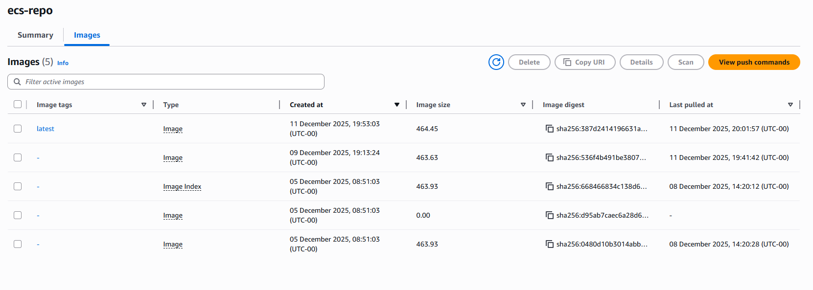

I did this part manually and locally and i reference the ECR repo in my terraform ECR module with a data block. I also ensure that developers changes are automated and a new docker image is built and pushed to ECR through my CI pipeline

## The ALB resource map

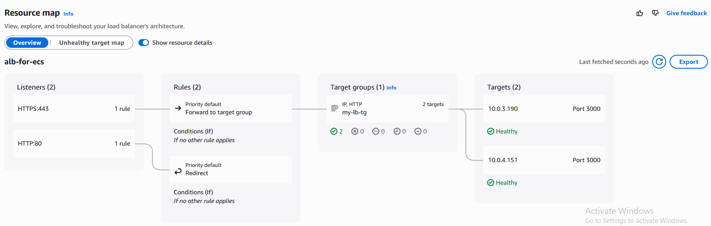

Here we can see that the HTTP listener redirects HTTP requests to the HTTPS listener, and the HTTPS listener forwards the HTTPS requests to the target group which automatically registers targets via the ECS service. Both targets are healthy

## Route 53 and ACM certificate

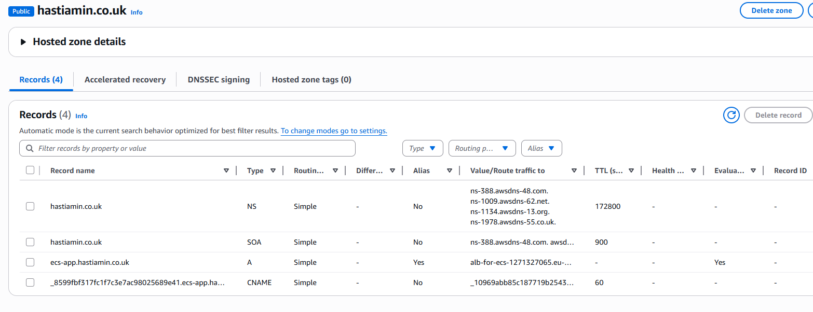
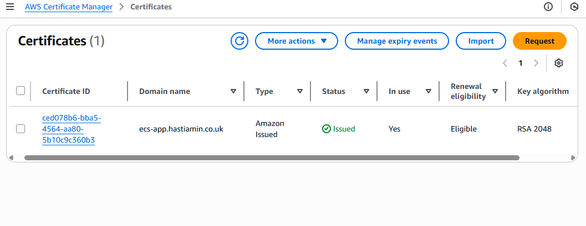

Here we can see that I have an Alias A record that points my domain name to the ALB dNS name, so that whenever someone visits my domain they are pointed to the ALB DNS name. I have also configured a CNAME record for the SSL/TLS certificate.

## ECS cluster service + tasks

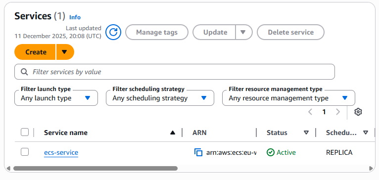
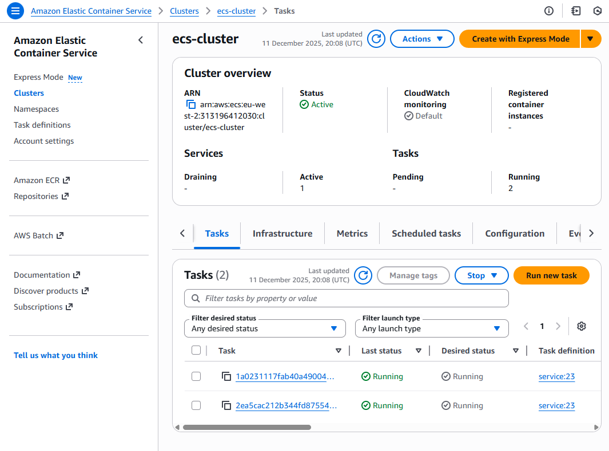

Here I have configred a task definition which is trigged through my ECS service, this creates the amount of tasks specified in the task definition. Both tasks are running and healthy

## CI pipeline, this builds the docker image with updated changes and pushes it to ECR

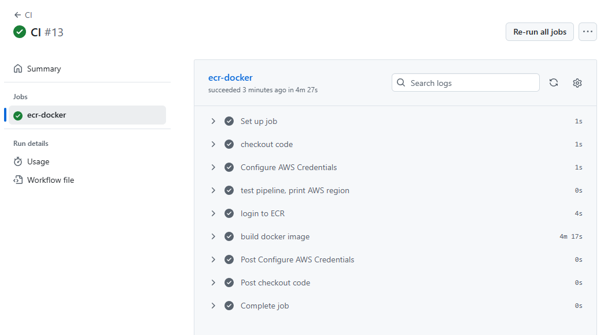

My CI pipeline is a manual trigger. Firstly it checks out the code and configures AWS credentials. I have used secrets to store my AWS access keys because that is sensitive data. Then it logs into ECR and builds a new docker image and pushes it to ECR. So whenever developers make changes to the code and push to GitHub, they can manually run the pipeline to build an updated docker image. Then the CD pipeline can be run to deploy the updated docker image

## CD pipeline, this runs terraform apply and starts building the infrastructure. I have also included a confirmation check

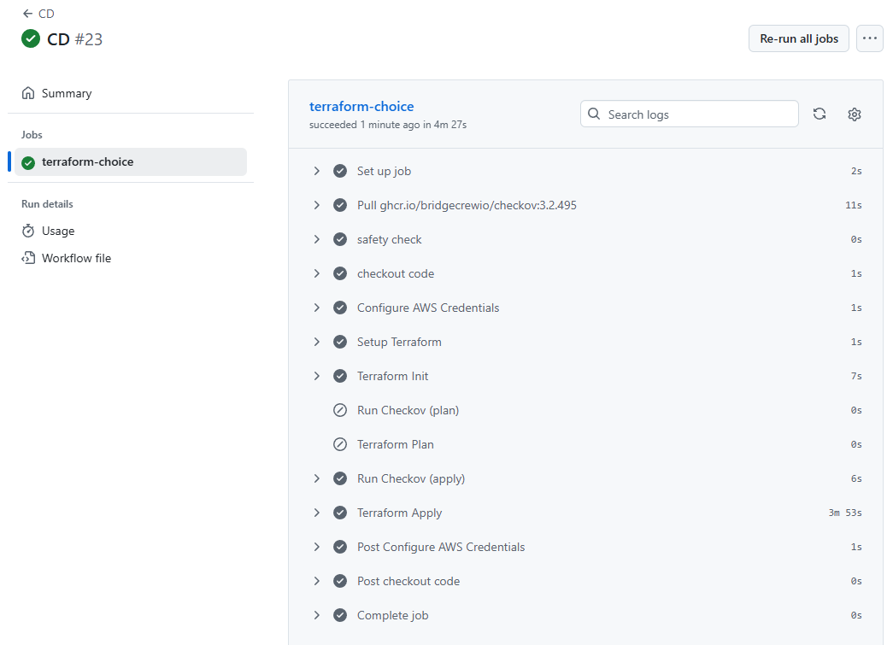

My CD pipeline is a manual trigger. It has a safety check to ensure that the developer types 'yes' to run the pipeline. Firstly it checks out the code and configures AWS credentials. I have used secrets to store my AWS access keys because that is sensitive data. After that it sets up terraform and runs 3 terraform commands:

```
terraform init
terraform plan
terraform apply --auto-approve
```

This allows us to initialise the terraform, we also get to see the plan in the pipeline and it then builds the infrastructure

## Destroy infra pipeline, this runs terraform destroy and removes the infrastructure. I have also included a confirmation check

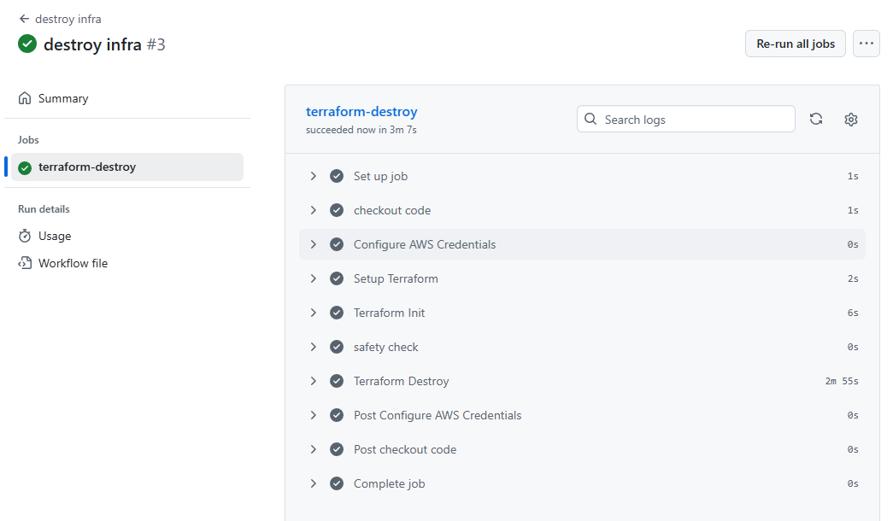

My destroy infra pipeline is a manual trigger. It has a safety check to ensure that the developer types 'yes' to run the pipeline. Firstly it checks out the code and configures AWS credentials. I have used secrets to store my AWS access keys because that is sensitive data. After that it sets up terraform and runs the command:

```
terraform init
```

This initialises the terraform, after that we run the command:

```
terraform destroy --auto-approve
```

This tears down the infrastructure

## This is the deployed app

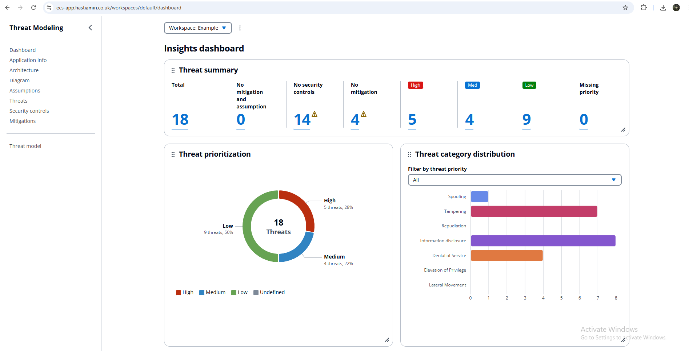

## Local App Setup

```bash
yarn install
yarn build
yarn global add serve
serve -s build

#yarn start
http://localhost:3000/workspaces/default/dashboard

```
